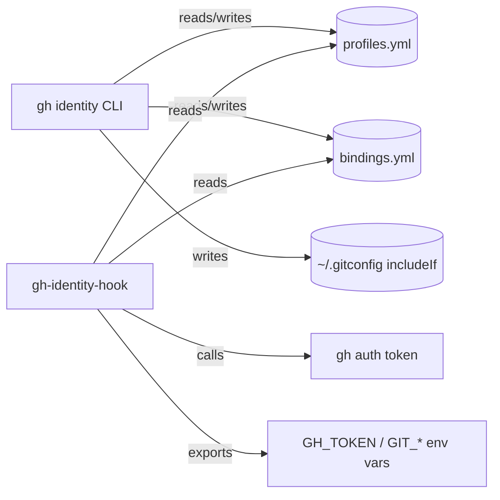
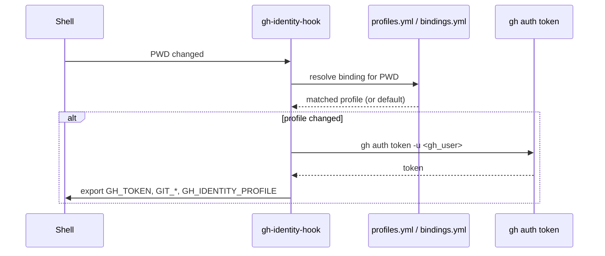
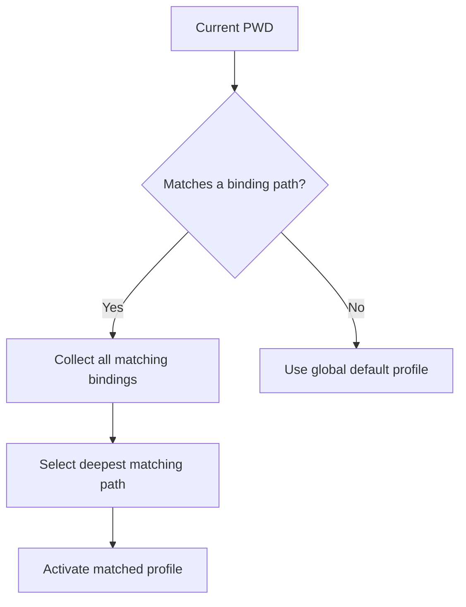

# gh-identity

> *"One shell, many identities."*

**gh-identity** is a `gh` extension that provides seamless multi-account management, automatic context-based account switching, and per-directory identity binding.

## Problem

`gh` supports multiple authenticated accounts via `gh auth switch`, but the experience is manual and global. There is no way to:

- Automatically switch accounts based on the current repository or directory.
- Bind a directory tree to a specific GitHub identity.
- Switch git author configuration (`user.name`, `user.email`) in tandem with the `gh` active account.
- Get a quick visual indicator of which identity is active.
- Clone a repo and automatically bind the correct account to it.

Users who operate across personal and work/org accounts must constantly run `gh auth switch -u <user>` and manually adjust their git config, which is error-prone and tedious.

## Current State

`gh` stores its authentication in `~/.config/gh/hosts.yml`:

```yaml
github.com:
  git_protocol: https
  users:
    nadamou3:
    nicholasadamou:
  user: nadamou3  # the "active" account
```

Switching is global — changing the active user affects every terminal and every directory simultaneously.

Git author identity (`user.name`, `user.email`) is managed entirely separately via `~/.gitconfig` or per-repo `.git/config` and is never touched by `gh`.

## Design

### Identity Profiles

`gh identity` introduces the concept of a **profile** — a named bundle that ties together:

| Field | Description |
|---|---|
| `gh_user` | The `gh` account username (must already be authenticated via `gh auth login`). |
| `git_name` | The `user.name` to set in git config. |
| `git_email` | The `user.email` to set in git config. |
| `ssh_key` | *(Optional)* Path to the SSH key associated with this identity. |

Profiles are stored in `~/.config/gh-identity/profiles.yml`:

```yaml
profiles:
  personal:
    gh_user: nicholasadamou
    git_name: Nicholas Adamou
    git_email: nicholasadamou@users.noreply.github.com
    ssh_key: ~/.ssh/id_ed25519_personal

  work:
    gh_user: nadamou3
    git_name: Nicholas Adamou
    git_email: nadamou3@company.com
    ssh_key: ~/.ssh/id_ed25519_work
```

### Directory Binding

A profile can be **bound** to a directory. When `gh identity` detects the shell is inside a bound directory (or any of its children), it automatically activates the correct profile.

Bindings are stored in `~/.config/gh-identity/bindings.yml`:

```yaml
bindings:
  - path: ~/code/github.com/dotbrains
    profile: personal
  - path: ~/code/github.com/my-company
    profile: work
```

Binding resolution walks up the directory tree from `$PWD` to `/`, using the **deepest matching** binding. If no binding matches, the global default profile is used.

### Shell Integration

`gh identity` provides a shell hook (Fish, Bash, Zsh) that runs on every directory change (`cd`, `pushd`, `z`, etc.) and:

1. Resolves the active profile for the new `$PWD` via binding lookup.
2. If the resolved profile differs from the currently active one:
   - Runs `gh auth token -u <gh_user>` and exports the result as `GH_TOKEN` (per-shell, no global state mutation).
   - Sets `GIT_AUTHOR_NAME`, `GIT_AUTHOR_EMAIL`, `GIT_COMMITTER_NAME`, `GIT_COMMITTER_EMAIL` environment variables.
   - Optionally updates `GIT_SSH_COMMAND` to point to the profile's SSH key.
3. Exports `GH_IDENTITY_PROFILE` so prompts/tools can display the active identity.

For Fish, this is implemented as a `--on-variable PWD` event function.

### Commands

#### `gh identity init`

Interactive first-time setup. Discovers existing `gh` authenticated accounts, walks the user through creating profiles for each, and installs the shell hook.

#### `gh identity profile add <name>`

Create a new profile interactively. Prompts for `gh_user` (with tab-completion from authenticated accounts), `git_name`, `git_email`, and optional `ssh_key`.

#### `gh identity profile list`

List all configured profiles, highlighting the currently active one.

#### `gh identity profile remove <name>`

Remove a profile and any associated bindings.

#### `gh identity bind [<path>] <profile>`

Bind a directory (defaults to `$PWD`) to a profile. Running any `gh` or `git` command inside that tree will automatically use the bound identity.

#### `gh identity unbind [<path>]`

Remove the binding for a directory (defaults to `$PWD`).

#### `gh identity switch <profile>`

Manually activate a profile for the current session, overriding any directory binding until the next directory change.

#### `gh identity status`

Display the active profile, the resolved `gh` user, git identity, and which binding (if any) matched.

```
 Profile:  personal
 Account:  nicholasadamou
 Name:     Nicholas Adamou
 Email:    nicholasadamou@users.noreply.github.com
 SSH Key:  ~/.ssh/id_ed25519_personal
 Bound by: ~/code/github.com/dotbrains
```

#### `gh identity clone <repo> [--profile <profile>]`

Wraps `gh repo clone`. After cloning, automatically binds the new directory to the specified profile (or the currently active one).

#### `gh identity doctor`

Validates the full setup:
- All profiles reference authenticated `gh` accounts.
- SSH keys exist and have correct permissions.
- Shell hook is installed and functioning.
- No conflicting bindings exist.

### Shell Prompt Integration

`gh identity` exports `GH_IDENTITY_PROFILE` so users can include the active identity in their prompt. An example Fish prompt snippet:

```fish
function fish_right_prompt
    set_color brblack
    echo -n "⚡ $GH_IDENTITY_PROFILE"
    set_color normal
end
```

## Implementation

- **Language:** Go, using the `go-gh` library for direct integration with `gh`'s auth and config subsystems.
- **Config format:** YAML, consistent with `gh`'s own config files.
- **Distribution:** `gh extension install dotbrains/gh-identity`, or via Homebrew (`brew install dotbrains/tap/gh-identity`).
- **Shell hooks:** Installed via `gh identity init` by appending a single `source` line to `~/.config/fish/config.fish`, `~/.bashrc`, or `~/.zshrc`.

## Testing

**Target: 80% code coverage**, enforced in CI.

### Unit Tests

All packages are tested via `go test ./...`. Key areas:

- **Profile resolution** — loading, validating, and merging profiles from YAML.
- **Binding resolution** — deepest-match directory walk logic, including edge cases (symlinks, trailing slashes, home-dir expansion).
- **Config I/O** — round-trip read/write of `profiles.yml`, `bindings.yml`, and `includeIf` gitconfig fragments.
- **Command flags/args** — each subcommand's argument parsing and error handling.

Use `t.TempDir()` for any test that touches the filesystem. Mock `gh auth token` calls via interface injection rather than shelling out.

### Integration Tests

A small set of integration tests (build-tagged `//go:build integration`) exercise the full CLI binary against a real `gh` installation:

- `gh identity bind` → `gh identity status` round-trip.
- Shell hook binary resolves the correct profile after `cd`.
- `gh identity doctor` detects misconfigured state.

These run in CI but are skipped locally unless explicitly opted in (`go test -tags integration ./...`).

### Coverage

Generate coverage with:

```sh
go test -coverprofile=coverage.out ./...
go tool cover -func=coverage.out
```

CI fails the build if total coverage drops below 80%.

## CI / GitHub Actions

### `.github/workflows/ci.yml`

Runs on every push and pull request to `main`.

**Jobs:**

1. **lint** — `golangci-lint run`.
2. **test** — `go test -race -coverprofile=coverage.out ./...`, then fail if coverage < 80%.
3. **build** — `go build ./...` across `GOOS=darwin,linux` × `GOARCH=amd64,arm64`.

### `.github/workflows/release.yml`

Runs on version tags (`v*`).

**Jobs:**

1. **goreleaser** — builds binaries, archives, and publishes a GitHub Release via [GoReleaser](https://goreleaser.com).
2. **homebrew** — updates the `dotbrains/tap` formula with the new version.

## Documentation

The repository README (`README.md`) serves as the primary user-facing documentation and covers installation, quickstart, and command reference. Deeper topics live in a `docs/` directory:

- `docs/architecture.md` — system overview and data flow (includes the diagrams below).
- `docs/shell-hooks.md` — per-shell installation details and troubleshooting.
- `docs/contributing.md` — development setup, running tests, and release process.

### Architecture



### Shell Hook Lifecycle



### Binding Resolution



## Non-Goals

- **Token management.** `gh identity` does not store or manage GitHub tokens. It delegates all authentication to `gh auth`. Users must run `gh auth login` for each account before configuring profiles.
- **GitHub Enterprise routing.** The initial version targets `github.com` only. Multi-host support (e.g., `github.com` + `github.enterprise.com`) may be added later.
- **Git credential helper replacement.** `gh identity` sets environment variables but does not replace or interfere with git credential helpers.

## Design Decisions

### 1. Token Strategy: `GH_TOKEN` env var, not `gh auth switch`

`gh identity` **never** calls `gh auth switch`. Instead, the shell hook runs `gh auth token -u <gh_user>` to extract the token for the active profile and exports it as `GH_TOKEN`. Since `gh` respects `GH_TOKEN` as an override over its config file, this keeps all state per-shell and eliminates the global mutation race condition entirely.

The token is cached in the shell session and only refreshed when the profile changes (i.e., on `cd` into a differently-bound directory). This means:

- Two terminals in different directories use different accounts simultaneously with zero conflict.
- `~/.config/gh/hosts.yml` is never written to by `gh identity`.
- The `gh auth login`-managed keyring remains the single source of truth for tokens.

### 2. Git Identity: `includeIf` directives, not env vars

`gh identity` uses git's native `includeIf "gitdir:..."` mechanism for persistent git identity. When a user runs `gh identity bind ~/code/myorg work`, `gh identity`:

1. Writes a profile-specific gitconfig fragment:

```gitconfig
# ~/.config/gh-identity/git/work.gitconfig
[user]
    name = Nicholas Adamou
    email = nadamou3@company.com
```

2. Adds an `includeIf` entry to `~/.gitconfig`:

```gitconfig
[includeIf "gitdir:~/code/myorg/"]
    path = ~/.config/gh-identity/git/work.gitconfig
```

This approach:

- Works in **all** tools (IDEs, scripts, CI runners, `git` invoked directly) — not just shells with the `gh identity` hook.
- Survives shell restarts and new terminal sessions with zero hook dependency for git identity.
- Uses a native, well-documented git feature with no custom machinery.

The shell hook still exports `GIT_AUTHOR_NAME`/`GIT_AUTHOR_EMAIL` as a belt-and-suspenders override for the current session, but the `includeIf` layer is the durable source of truth.

### 3. Packaging: `gh` extension with standalone shell hook binary

`gh-identity` ships as a **`gh` extension** (`gh extension install dotbrains/gh-identity`) with a companion standalone binary for the shell hook.

The extension itself handles all interactive commands (`gh identity init`, `gh identity bind`, `gh identity status`, etc.) through the standard `gh` extension lifecycle. However, the shell hook — which fires on every directory change — invokes a lightweight standalone binary (`gh-identity-hook`) that resolves the active profile in <5ms without paying `gh`'s ~50ms startup overhead.

`gh identity init` installs the hook binary to `~/.config/gh-identity/bin/` and wires it into the shell config.

Primary distribution channels:

- `gh extension install dotbrains/gh-identity`
- `brew install dotbrains/tap/gh-identity`
- GitHub Releases (prebuilt binaries for macOS arm64/amd64, Linux amd64)
